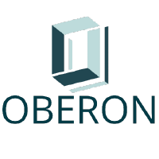

<h3 align="center">
  
</h3>

# OBERON

  Um sistema de <b>monitoramento inteligente de hardware, software e rede em computadores CFTV</b>, com foco em <b>redução de downtime</b>, <b>manutenção preditiva</b> e <b>segurança cibernética</b>.

     
     

     
    
    

     
    
    

## 🚨 Problema
- Monitoramento insuficiente de Hardware
- Falta de detecção proativa de falhas
- Susceptibilidade e sabotagens internas
- Falta de visibilidade para equipes de TI e Segurança

## 💡 Solução
- Monitoramento contínuo de CPU, memória, disco e rede.  
- Alertas automáticos configuráveis.  
- Dashboard de observabilidade em tempo real.  
- Integração com sistemas de tickets (Jira).  
- Conformidade com PCI-DSS e normas do BACEN.  

## 📊 Caso Real
-  Em um incidente real, na Caixa Econômica Federal, um funcionário interno foi responsável por desligar o sistema de câmeras de segurança, o que resultou em um prejuízo de cerca de R$ 600 mil. Este caso exemplifica a importância de um sistema de monitoramento proativo como o Oberon. Se o sistema tivesse monitorado a saúde do hardware e detectado comportamentos anormais ou falhas no computador de CFTV, o desligamento não teria passado despercebido e a intervenção poderia ter ocorrido rapidamente, evitando o grande prejuízo financeiro.

## 🗂️ Estrutura da Organização
Este projeto está dividido em múltiplos repositórios:  

- 📂 [Oberon-Banco-De-Dados](../Oberon-Banco-De-Dados) → Banco de Dados  
- 📂 [Oberon-Coleta-Python](../Oberon-Coleta-Python) → Agente de Monitoramento (coleta)  
- 📂 [Oberon-Coleta-Java](../Oberon-Coleta-Java) → Backend (ETL)  
- 📂 [Oberon-Projetos-Individuais](../Oberon-Projetos-Individuais) → Projetos individuais em Java da Sprint 1
- 📂 [Oberon-Aplicacao-Web](../Oberon-Aplicacao-Web) → Interface Web (Dashboard)  
- 📂 [Oberon-Config-AWS](../Oberon-Config-AWS) → Configuração da instancia EC2
- 📂 [.github](../.github) → Documentação geral e configurações  

## ⚙️ Tecnologias

  
  
  
  
  
  

## 🌐 Arquitetura do Sistema
<!-- 

  

 -->

- 🏧 **ATMs** → origem dos dados (CPU, memória, disco, rede).  
- 🐍 **Agente Python** → coleta de métricas em tempo real e envio para S3.  
- ☕ **ETL em Java** → processamento e transformação dos dados em EC2.  
- 🗄️ **MySQL** → armazenamento centralizado das métricas.  
- 🌐 **Interface Web (JS, HTML, CSS)** → dashboards e relatórios.  
- 📢 **Integrações** → envio de alertas para Jira, Slack e Email.  
- 🤖 **Módulo de Machine Learning (Python/R)** → análises preditivas.  

## Requisitos
- ...

## ✒️ Equipe

<table >

<td align="center" width="125px"><a  href= "https://github.com/brubrumartins"> <b>Bruna Martins</b> </</a>   Suporte  &  Back-End     
</td>

<td  align="center" width="125px"><a  href= "https://github.com/d1n4ara" > <b>Dandara Ramos</b></</a>    DBA  &  Front      
</td>

<td  align="center" width="125px"><a  href="https://github.com/JhoelDiego2" > <b>Jhoel Mita</b></</a>   Scrum Master  &  Fullstack    
</td>
<td  align="center" width="125px"><a  href="https://github.com/MIGUELLIMA11" > <b>Miguel Sousa</b></</a>   Infra &  Back-end    
</td>
<td  align="center" width="125px" ><a  href="https://github.com/nathanbarbosatx" > <b>Nathan Barbosa</b></</a>   Product Owner  &  Back-End    
</td>
<td  align="center" width="125px"><a  href="https://github.com/pedrosakaue" > <b>Pedro Sakaue</b></</a>   DBA  &  Front-End    
</td>

